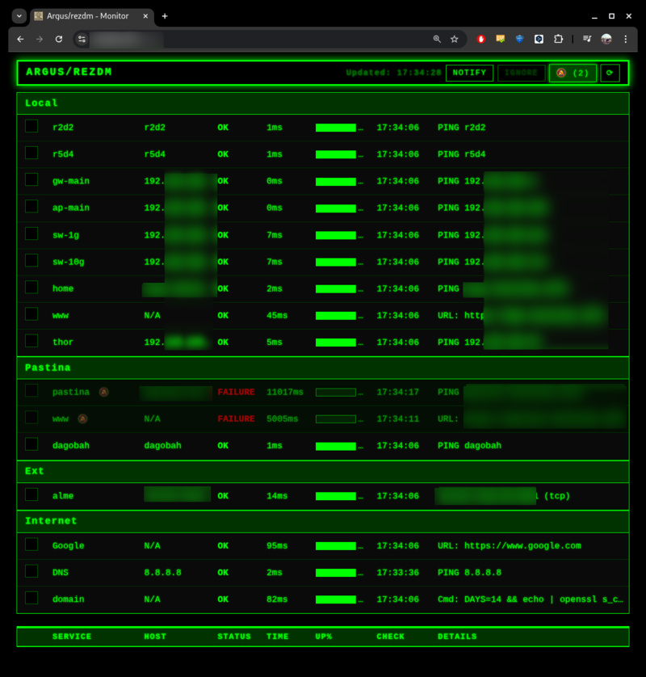
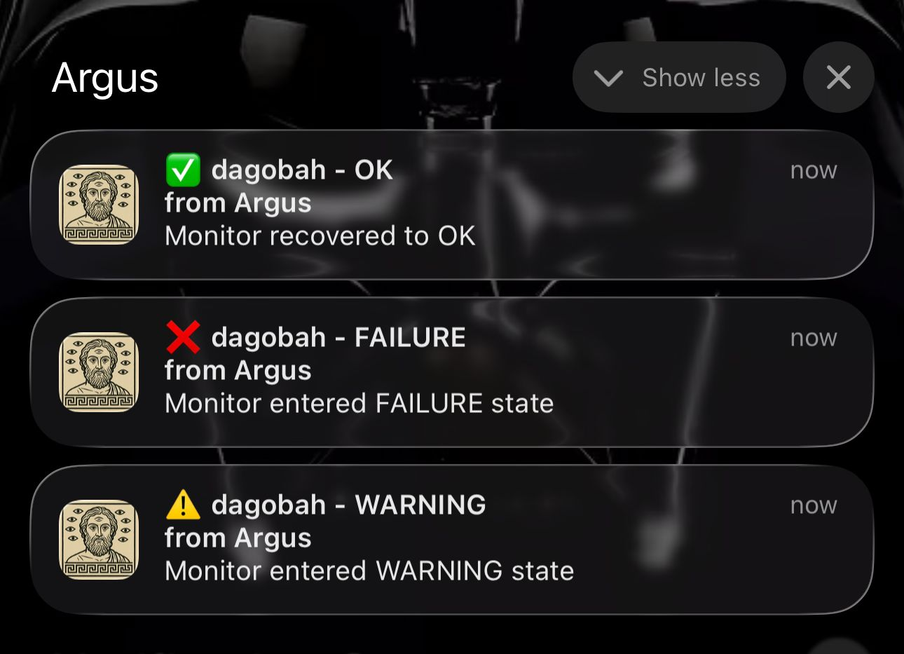

# Argus
A network monitoring daemon that provides a quick overview of service availability via ICMP ping, TCP/UDP ports, HTTP/HTTPS, or just a command line with an expected exit value.

The original project was Java-based — [Argus](https://github.com/rezdm/Argus). I worked on it as a playground to explore Java 25 features, and at some point needed AI help, and then decided... why not translate it to C++, back to the roots, so to speak.

I liked the result of the translation and decided to continue with the C++-based project.

## Name
[Argus](https://en.wikipedia.org/wiki/Argus_Panoptes) is a creature from Ancient Greek mythology. A may-eyed giant, serverd as a watchman to Hera (sister ofe of Zeus).

## Output
The program exposes an endpoint and serves a static (configurable) HTML page:


## Build
* Generate build and prepare for installation
```
cmake -S src/ -B build/ -DCMAKE_BUILD_TYPE=Release -DCMAKE_INSTALL_PREFIX=/opt/argus
```
* Compile, link
```
cmake --build build/ -j$(nproc)
```
* Run tests
```
cmake --build build/ --target check
```
## Install 
```
sudo cmake --install build/
```
On Linux, depending no distribution, additional step is needed to enable unprivileged ICMP sockets (better solution):
```
sudo sysctl -w net.ipv4.ping_group_range="0 65535"
```
Make it permanent
```
echo 'net.ipv4.ping_group_range = 0 65535' | sudo tee -a /etc/sysctl.conf
```
Or
```bash
sudo setcap cap_net_raw+ep ./build/bin/argus
```

(installation scripts should take care of this, but not tested)

Install should also run on SysV, init.rc for FreeBSD and Solaris SMF -- see folder [services](https://github.com/rezdm/Argus.cpp/tree/main/services).

## Uninstall
```
sudo cmake -S src/ -B build/ -DCMAKE_BUILD_TYPE=Release
sudo cmake --build build/ --target uninstall
```

## Run with systemd
```
sudo systemctl enable argus
sudo systemctl start argus
```

Monitor and restart
```
sudo journalctl -fu argus # follow logs
kill -SIGHUP $(pidof argus) - Hot-reload config
```

## Run manually
```bash
argus argus.json                               # stdout logging
argus -l /tmp/debug.log argus.json             # file logging
argus -d argus.json                            # daemon + default log file
argus -d -l /custom/path.log argus.json        # daemon + custom log file
argus -s argus.json                            # systemd mode
argus -s -l /custom/path.log argus.json        # systemd mode + custom log file
argus -v debug argus.json                      # change log level
```

## PWA + notifications
I found it most useful to "Add to Home Screen" on iPhone. In this case client side is running in a sandboxed instance of Safari, as a normal app. Most importantly, it receives notifications:


It is also possible to add testers to "ignore" state. In this case, testers will run, but push notifications will not be sent out. "Ignore" is set by user through UI with some expiration datetime. Default is current + 25h

# Keys
* Generate VAPID keys (private, public, pem and base64)
* Place them to to back-end config
* (no need to change front-end, it picks it up from a call to back-end)
* I am using fronting Apache with reverse proxy:
```xml
<VirtualHost *:443>
    ServerName ...
    DocumentRoot ...

    SSLEngine on
    SSLCertificateFile "....crt"
    SSLCertificateKeyFile "....key"

    ProxyPass /argus http://192.168.100.97:8080/argus
    ProxyPassReverse /argus http://192.168.100.97:8080/argus
</VirtualHost>
```
## Example configuration
```json
{
  "name": "Argus",
  "listen": "192.168.10.10:8080",
  "cache_duration_seconds": 0,
  "base_url": "/argus",
  "static_dir": "/opt/argus/var/pwa",
  "log_status_every_n": 50,
  "push_notifications": {
    "enabled": true,
    "subscriptions_file": "/opt/argus/var/subs.json",
    "vapid_subject": "mailto:john.doe@example.com",
    "vapid_public_key": "...base64 public key",
    "vapid_private_key": "...base64 private key"
  },
  "monitors": [
    {
      "sort": 10,
      "group": "Home",
      "destinations": [
        { "sort":  0, "name": "nas", "timeout": 1000, "warning": 1, "failure": 2, "reset": 1, "interval": 5, "history": 100, "test": { "method": "Ping", "host": "nas-station" }}
      ]
    }
  ]
}
```

## Testers
### Ping
As is, ping. The tool tries to use raw sockets, ICMP sockets, than fallbacks to calling OS ping command 
### Connect
* TCP connect to a host:port
* UDP send 0-length packet to host:port
### URL
Perform HTTP GET, check for non-error response. If URL is https, does not check certificate validity
### CMD
Run a command. I use it to check for domain certificate expiration:
```json
{ 
  "sort": 99, 
  "name": "domain", 
  "timeout": 3000, 
  "warning": 2, 
  "failure": 3, 
  "reset": 2, 
  "interval": 30, 
  "history": 100, 
  "test": { 
    "method": "Cmd", 
    "run": "DAYS=14 && echo | openssl s_client -servername www.example.com -connect www.example.com:443 2>/dev/null | openssl x509 -noout -checkend $(expr $DAYS \\* 86400)", 
    "expect": 0 
  }
}
```

## Improvements
This more or less a "mind map" of what I am consider doing, keeping in mind that initially this project was _just_ an application to ping 5-10 hosts and report to web. But as a Russian proverb sais "appetite arrives when one start eating", here's the list of potantial improvements.

### Quick wins and/or easy to implement
1. How to handle when back-end itself goes down
1. May be revise UI
   - I am not a front-end dev, just wanted something that looks as an old terminal, just in browser. Initially the project had a "template" setting in configuration and would basically pick up that .html to display a web page. I played with Claude to generate different UIs, but decided to stick with just one in the end.
   - May be create a dedicated .ts project, also build it, mnost importantly minimize the output .js
1. Make sure UI and service worker are self-updating
1. Export button - download current status as JSON/CSV
1. Bulk operations - select multiple tests to suppress/enable
1. Last incident timestamp - show when each service last failed
1. Service notes - add custom notes/descriptions per service
1. Keyboard shortcuts - R to refresh, ? for help, etc.
1. Browser notifications - even without push subscription
1. Sound alerts - optional beep when status changes
1. Compact view toggle - show more services on screen
1. Auto-pause when inactive - save bandwidth
1. Configuration backup - export/import full config
### High impact
1. Revise Ping implementation
1. Alert channels and integrations: email, webhooks to Slack/Teams/Telegram/Discord/..., SMS, etc
1. Maintenance Windows: alike suppressions, but something scheduled
1. Historical data and visualization
   - Store check results to disk/database (currently in-memory only)
   - Add charts showing response time trends over hours/days
   - Uptime reports (daily/weekly/monthly)
   - Useful for long-term monitoring
1. Authentication, multi-user support
   - Currently relies on reverse proxy for authentication
   - Add user accounts, login system and per-user notification preferences
   - Role-based access (viewer, operator, admin)
   - May be add public-facing status page with limited details and read-only mode
1. Subscribe to updates per service

### Medium Impact / Quality of Life
1. Web-based configuration
   - Allow change of configuration from UI
   - Live reload of this configuration from UI (now it is ``kill -1 {pid}`` or with systemd
1. Incident management
   - Acknowledge alerts (stop notifying once someone is aware)
   - Add notes/comments to incidents
   - Track time to resolution
   - Post-mortem templates
1. Enhance test types
   - If certain 'cmd' is found useful (e.g. domain certificate check, dns resolution) -- create dedicated test typ
1. Alerting improvements
   - Alert escalation (notify person B if person A doesn't ack in X minutes)
   - Alert grouping (if 5+ services fail, send one "multiple failures" alert)
   - On-call schedules and rotations
   - Rate limiting (don't spam if flapping)
1. Dashboard Enhancements
   - Global status overview (X/Y services healthy)
   - Group/service filtering and search
   - Customizable dashboards per user
   - Export data (CSV, JSON)
   - Print-friendly views

### Lower priority / nice to have
1. Distributed Monitoring
    - Might be bound with "How to handle when back-end itself goes down"
    - Multiple monitoring agents in different locations
    - Check from multiple regions
    - Detect regional outages vs global
1. Dependencies and relationships
    - Define service dependencies (A depends on B)
    - Show impact map (if B fails, A will also fail)
    - Smart alerting based on root cause -- start with not report "warning", not sure how to deal with "pending"; also requires persisting status and history
1. API and integrations
    - RESTful API for external tools
    - Integration with Prometheus/Grafana
    - Export metrics in standard formats
    - Plugin system for custom monitors -- I though initially of implementing testers as something "external" (when I started it as Java project), for C++ it is a bit more challenging
1. Advanced features
    - SLA tracking and compliance reporting
    - Performance baselines and anomaly detection
    - Predictive alerting (performance degrading)
    - Multi-tenancy for managed service providers
