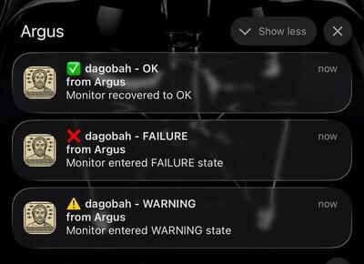

# Argus
A network monitoring daemon that provides a quick overview of service availability via ICMP ping, TCP/UDP ports, or HTTP/HTTPS. 

The original project was Java-based — [Argus](https://github.com/rezdm/Argus). I worked on it as a playground to explore Java 25 features, and at some point needed AI help, and then decided... why not translate it to C++, back to the roots, so to speak.

I liked the result of the translation and decided to continue with the C++-based project.

## Name
[Argus](https://en.wikipedia.org/wiki/Argus_Panoptes) is a creature from Ancient Greek mythology. A may-eyed giant, serverd as a watchman to Hera (sister ofe of Zeus).

## Output
The program exposes an endpoint and serves a static (configurable) HTML page:


## Build
* Generate build and prepare for installation
```
cmake -S src/ -B build/ -DCMAKE_BUILD_TYPE=Release -DCMAKE_INSTALL_PREFIX=/opt/argus
```
* Compile, link
```
cmake --build build/ -j$(nproc)
```
* Run tests
```
cmake --build build/ --target check
```
## Install 
```
sudo cmake --install build/
```
On Linux, depending no distribution, additional step is needed to enable unprivileged ICMP sockets (better solution):
```
sudo sysctl -w net.ipv4.ping_group_range="0 65535"
```
Make it permanent
```
echo 'net.ipv4.ping_group_range = 0 65535' | sudo tee -a /etc/sysctl.conf
```
Or
```bash
sudo setcap cap_net_raw+ep ./build/bin/argus
```

(installation scripts should take care of this, but not tested)

Install should also run on SysV, init.rc for FreeBSD and Solaris SMF -- see folder [services](https://github.com/rezdm/Argus.cpp/tree/main/services).

## Uninstall
```
sudo cmake -S src/ -B build/ -DCMAKE_BUILD_TYPE=Release
sudo cmake --build build/ --target uninstall
```

## Run with systemd
```
sudo systemctl enable argus
sudo systemctl start argus
```

Monitor and restart
```
sudo journalctl -fu argus # follow logs
kill -SIGHUP $(pidof argus) - Hot-reload config
```

## Run manually
```bash
argus argus.json                               # stdout logging
argus -l /tmp/debug.log argus.json             # file logging
argus -d argus.json                            # daemon + default log file
argus -d -l /custom/path.log argus.json        # daemon + custom log file
argus -s argus.json                            # systemd mode
argus -s -l /custom/path.log argus.json        # systemd mode + custom log file
argus -v debug argus.json                      # change log level
```

## PWA + notifications
I found it most useful to "Add to Home Screen" on iPhone. In this case client side is running in a sandboxed instance of Safari, as a normal app. Most importantly, it receives notifications:


# Keys
* Generate VAPID keys (private, public, pem and base64)
* Place them to to back-end config
* Place to pwa/app.js (may be I implement later taking it from a separate file)
* I am using fronting Apache with reverse proxy:
```xml
<VirtualHost *:443>
    ServerName ...
    DocumentRoot ...

    SSLEngine on
    SSLCertificateFile "....crt"
    SSLCertificateKeyFile "....key"

    ProxyPass /argus http://192.168.100.97:8080/argus
    ProxyPassReverse /argus http://192.168.100.97:8080/argus
</VirtualHost>
```
## Example configuration
```json
{
  "name": "Argus",
  "listen": "192.168.10.10:8080",
  "cache_duration_seconds": 0,
  "base_url": "/argus",
  "static_dir": "/opt/argus/var/pwa",
  "log_status_every_n": 50,
  "push_notifications": {
    "enabled": true,
    "subscriptions_file": "/opt/argus/var/subs.json",
    "vapid_subject": "mailto:john.doe@example.com",
    "vapid_public_key": "...base64 public key",
    "vapid_private_key": "...base64 private key"
  },
  "monitors": [
    {
      "sort": 10,
      "group": "Home",
      "destinations": [
        { "sort":  0, "name": "nas", "timeout": 1000, "warning": 1, "failure": 2, "reset": 1, "interval": 5, "history": 100, "test": { "method": "Ping", "host": "nas-station" }}
      ]
    }
  ]
}
```

## Testers
### Ping
As is, ping. The tool tries to use raw sockets, ICMP sockets, than fallbacks to calling OS ping command 
### Connect
* TCP connect to a host:port
* UDP send 0-length packet to host:port
### URL
Perform HTTP GET, check for non-error response. If URL is https, does not check certificate validity

## Improvements
* As of now I rely on fronting/revers proxying for security. I'd like to introduce some security directly into the project
* UI, etc
* libcrypto usage -- /me not like, it can be improved